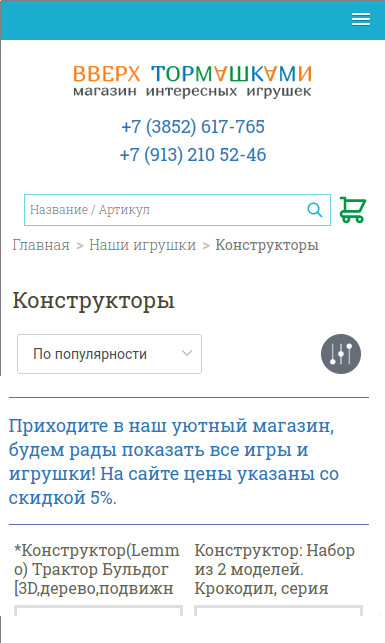
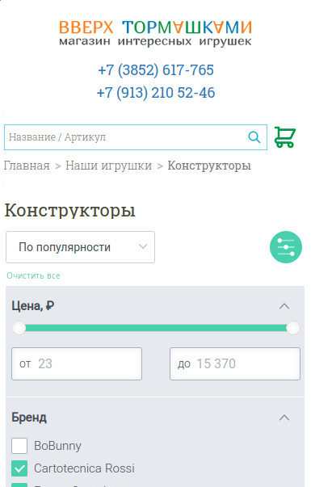
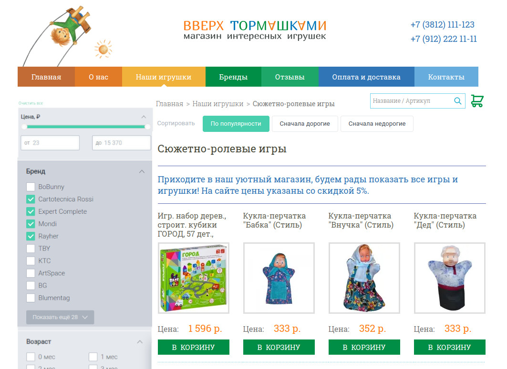

# Задание на верстку страницы раздела каталога

## Установка 
1. [Скачать](https://git-scm.com/download/win) и установить Git
2. [Скачать](https://github.com/coreybutler/nvm-windows/releases/download/1.1.9/nvm-setup.exe)  и  установить Node Virtual Environment (NVM)
3. Скачать Node версии 16.4.2. Для этого в командном окне(cmd.exe) выполнить - `nvm install v16.14.2`
4. Указать скаченную версию Node как текущую. Для этого в командном окне(__с правами Администратора__) выполнить - `nvm use 16.14.2`
5. Склонировать проект задания(Проект). Для этого в командном окне с правами пользователя выполнить - `git clone https://github.com/jigius/tpl-main-page.git` в текущую папку
6. Перейти в папку Проекта. Выполнить - `cd tpl-main-page`
7. Установить все библиотеки Проекта. Выполнить - `npm install`
8. Собрать страницу. Выполнить - `npm run build`

После успешной сборки появится файл Главной страницы `dist/category.html`, которую можно открыть в броузере. 

### Общие сведения
Требуется форкнуть и склонировать проект задания. После этого можно непосредственно править шаблон и ассетсы страницы.
В процессе работы над задачей, удобно использовать автоматическую сборку с включенным режимом разработки.

Исходники (шаблон страницы и ассетсы) находятся в папке `/src`.

Режим разработки запускается командой `npm run start`. В этом режиме запускается http-сервер(порт 8080) и открывается
броузер. При внесении правок, в автоматическом режиме пересобирается Проект и обновляется страница в
броузере.

Результат предоставляется в виде пулл-реквеста в оригинальный проект. 

### ТЗ

Нужно адаптировать блок фильтра к текущей сетке страницы.

#### Референсы
1. Общий вид фильтра и его блоков - [тут](https://umitoy.ru/toys/creativity/materialy-dlya-tvorchestva/materialy/tsvetnaya-bumaga/?set_filter=y&f_124_2755625286=Y&f_124_2786819421=Y&f_124_3010671297=Y&f_124_2768808424=Y&f_124_1530721764=Y&f_124_2628388234=Y&f_124_4172862750=Y). Взять нужно только три блока: Цена, Бренд, Возраст.
2. Общий вид адаптированного фильтра (media only screen and (min-width: 688px) and (max-width: 989px))  




3. Общий вид адаптированного фильтра 


#### Требуется сверстать
1. Блок фильтра со всеми распахнутыми его разделами (цена, бренд, возраст), и кнопкой "Показать еще XX" (для последних двух).
2. В стилях слайдера зарегистрировать правила отображения для значка "Свернуть".
3. Блок Цена должен содержать ползунок выбора диапазона цен.
4. Править можно только содержимое файлов `src/partials/category/{filter,filter-mob}.html` 
5. Стили определять в файле `src/styles/partials/category/filter.scss` 

#### Ожидаемый результат

1. Постольку, поскольку макета для верстки не предоставлено, то верстку требуется делать исходя из той информации
которая предоставлена здесь. Например, отступы и размеры элементов отданы на выбор Исполнителя, единственное требование
здесь - чтобы они были примерно соразмерны остальным элементам и блокам на странице. Начертание шрифта использовать текущий для
страницы. Для уточнения ТЗ или другому вопросу требуется создать `issue` на странице проекта гитхаб, в котором его сформулировать. 

2. Никакого js-кода и никаких сторонних css-фреймворков.

3. Требуется сохранить у блоков фильтра такую структуры: 
```
<ol>
    <li class="inputs expand show">
        <div class="title">XXX</div>
        <ul> ... </ul>
        <div class="show-all">YYY</div>			
    </li>
    ...
</ol>
```
